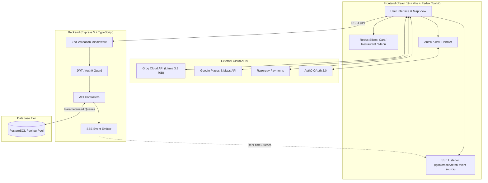

# 🍽️ CraveKart — Intelligent Food Discovery & Ordering Platform

<p align="center">
  
  
  
  
  
  
  
  
</p>

<p align="center">
  <strong>CraveKart</strong> is an enterprise-grade, full-stack food discovery and ordering web platform featuring AI-powered conversational search, real-time live order streaming via Server-Sent Events (SSE), hybrid Auth0 + dual-token JWT authentication, and interactive GIS mapping.
</p>

---

## 📑 Table of Contents

- [✨ Key Features](#-key-features)
- [🏗️ System Architecture](#️-system-architecture)
- [🛠️ Tech Stack](#️-tech-stack)
- [📁 Project Structure](#-project-structure)
- [🗄️ Database Schema](#️-database-schema)
- [🚀 Getting Started](#-getting-started)
  - [Prerequisites](#prerequisites)
  - [1. Clone Repository](#1-clone-repository)
  - [2. Backend Setup](#2-backend-setup)
  - [3. Frontend Setup](#3-frontend-setup)
- [🔐 Environment Variables](#-environment-variables)
- [📡 API Reference](#-api-reference)
- [🌐 Internationalization (i18n)](#-internationalization-i18n)
- [🤝 Contributing](#-contributing)
- [📄 License](#-license)

---

## ✨ Key Features

### 🤖 AI Natural Language Search (Groq + Llama 3.3 70B)
- Converts conversational queries (e.g., *"spicy veg noodles under ₹250"*) into structured query objects.
- Built-in regex pre-filtering to catch gibberish queries locally before hitting the LLM API.
- Automatic JSON sanitization and fallback handling.

### 📡 Real-Time Order & Cart Streaming (Server-Sent Events)
- Unidirectional, low-overhead HTTP streaming using `@microsoft/fetch-event-source`.
- Live order status updates (*Received* $\rightarrow$ *Preparing* $\rightarrow$ *Out for Delivery* $\rightarrow$ *Delivered*).
- Instant cart synchronization and price update broadcasting.

### 🔐 Hybrid Authentication & Security
- **OAuth 2.0 / OIDC**: Social logins (Google, GitHub) via `@auth0/auth0-react`.
- **Native Dual-Token JWT**: Short-lived Access Tokens (15m) + Long-lived Refresh Tokens with secure token rotation.
- **Password Security**: Salted password hashing via `bcryptjs`.
- **Runtime Validation**: Strict request payload validation using **Zod** schemas.

### 🗺️ Location & GIS Mapping
- Interactive geospatial maps powered by **Leaflet** & **Google Maps Places API**.
- Pinpoint nearby restaurants, calculate coordinates, and view live restaurant markers.

### 💳 Payment & Checkout Experience
- Integrated payment gateway via **Razorpay**.
- Dynamic QR code generation for instant payments.
- Real-time cart calculations with tax, delivery fee, and discount estimation.

### 📊 Restaurant & Admin Dashboard
- Manage restaurant listings, menu items, prices, and availability.
- Track incoming customer orders in real-time.

### 🌐 Multi-Language Support (i18n)
- Full internationalization using `i18next` with automatic browser language detection.
- Seamless multi-language UI translation switching.

### 🎨 Modern UI / UX & Theming
- Built with **React 19**, **TailwindCSS v4**, and **Lucide Icons**.
- Smooth transitions, responsive mobile-friendly layouts, and Dark / Light theme toggle.

---

## 🏗️ System Architecture



---

## 🛠️ Tech Stack

| Domain | Technology | Purpose |
| :--- | :--- | :--- |
| **Frontend Core** | React 19, TypeScript, Vite 8 | High-performance SPA with type safety |
| **State Management** | Redux Toolkit, React-Redux | Centralized store with Async Thunks & Immer |
| **Styling & Icons** | TailwindCSS v4, Lucide React | Modern responsive design & iconography |
| **Routing** | React Router v7 | Client-side page navigation |
| **Real-time Protocol** | Server-Sent Events (SSE) | Persistent unidirectional server push |
| **AI / NLP** | Groq Cloud API (Llama 3.3 70B) | Natural language query parsing |
| **Backend Runtime** | Express 5, TypeScript, Node.js | Next-gen async API server |
| **Validation** | Zod, Express-Validator | Runtime request schema validation |
| **Authentication** | Auth0 React, JWT (`jsonwebtoken`), Bcrypt | Hybrid OAuth 2.0 + Token rotation |
| **Database** | PostgreSQL, `pg` (Connection Pooling) | Relational database with parameterized queries |
| **Maps & GIS** | Leaflet, Google Maps API Loader | Spatial coordinate mapping & location search |
| **Payments** | Razorpay, QR Code React | Checkout gateway and QR billing |
| **i18n** | i18next, react-i18next | Multi-language translation engine |

---

## 📁 Project Structure

```text
craveKart/
├── Backend/                      # Express 5 + TypeScript Server
│   ├── src/
│   │   ├── controllers/          # Request handlers (Auth, Restaurant, Menu, Orders)
│   │   ├── middlewares/          # JWT verification, SSE setup, error handlers
│   │   ├── Repository/           # Database query abstractions
│   │   ├── routes/               # Modular Express routes
│   │   ├── services/             # Business logic & external API wrappers
│   │   ├── validation/           # Zod validation schemas
│   │   ├── db.ts                 # PostgreSQL connection pool configuration
│   │   ├── schema.sql            # Database schema & DDL scripts
│   │   └── server.ts             # Application entry point
│   ├── .env                      # Backend environment variables
│   ├── package.json
│   └── tsconfig.json
│
├── Frontend/                     # React 19 + Vite Application
│   ├── public/                   # Static public assets
│   ├── src/
│   │   ├── assets/               # Images and media
│   │   ├── Components/           # UI Components
│   │   │   ├── dashboard/        # Restaurant Admin management views
│   │   │   ├── header/           # Navigation bar, search, and user profile
│   │   │   ├── Hooks/            # Custom React hooks
│   │   │   ├── Redux/            # Redux store & domain slices
│   │   │   ├── ui/               # Base UI & Radix components
│   │   │   ├── Body.tsx          # Home page & hero section
│   │   │   ├── Cart.tsx          # Shopping cart with SSE order sync
│   │   │   ├── Menu.tsx          # Dynamic restaurant menu view
│   │   │   ├── RestaurantMap.tsx # Leaflet & Google Maps GIS component
│   │   │   ├── Restaurants.tsx   # Restaurant listing & filtering
│   │   │   └── Themetoggle.tsx   # Light/Dark mode switcher
│   │   ├── Services/             # API client, Auth services, Places API
│   │   ├── locales/              # i18n translation dictionaries
│   │   ├── i18n.ts               # Translation config
│   │   ├── App.tsx               # Main routing tree
│   │   └── main.tsx              # React DOM root mounting
│   ├── .env                      # Frontend environment variables
│   ├── package.json
│   └── vite.config.ts
│
├── PROJECT_SUMMARY.md            # In-depth technical architecture document
└── README.md                     # Project documentation
```

---

## 🗄️ Database Schema

CraveKart utilizes a relational schema in PostgreSQL designed with foreign key constraints, indexes, and cascade protections:

- `users` — User profiles, Auth0 ID linkage, roles (`user`, `admin`), hashed passwords.
- `restaurants` — Place ID, name, ratings, GIS lat/long coordinates, operating status.
- `menu_items` — Restaurant-specific dishes, pricing, description, vegetarian flag.
- `restaurant_owners` — User-to-restaurant administrative ownership mappings.
- `cart_items` — Persistent user cart items and quantities.
- `orders` — Order headers with total price, status (`preparing`, `out_for_delivery`, `delivered`), and payment IDs.
- `order_items` — Itemized line items linked to orders.
- `refresh_tokens` — Secure token store for JWT rotation.
- `sessions` — UUID-based active user sessions.

---

## 🚀 Getting Started

### Prerequisites

Ensure you have the following installed on your machine:
- **Node.js**: `v18.0.0` or higher
- **npm** or **yarn** / **pnpm**
- **PostgreSQL**: `v14+` running locally or on a cloud provider (e.g., Supabase, Neon)

---

### 1. Clone Repository

```bash
git clone https://github.com/AdeebHaris/cravekart.git
cd cravekart
```

---

### 2. Backend Setup

1. **Navigate to the Backend directory:**
   ```bash
   cd Backend
   ```

2. **Install dependencies:**
   ```bash
   npm install
   ```

3. **Configure Environment Variables:**
   Create a `.env` file inside `Backend/` (refer to [.env reference](#backend-env)).

4. **Initialize Database:**
   Execute the schema file in PostgreSQL:
   ```bash
   psql -U postgres -d cravekart -f src/schema.sql
   ```

5. **Start Backend Server:**
   ```bash
   # Development mode with hot reload
   npm run dev

   # Build & run production
   npm run build
   npm start
   ```
   *The backend will be available at `http://localhost:5000`.*

---

### 3. Frontend Setup

1. **Navigate to the Frontend directory:**
   ```bash
   cd ../Frontend
   ```

2. **Install dependencies:**
   ```bash
   npm install
   ```

3. **Configure Environment Variables:**
   Create a `.env` file inside `Frontend/` (refer to [.env reference](#frontend-env)).

4. **Start Vite Dev Server:**
   ```bash
   npm run dev
   ```
   *The application will launch at `http://localhost:5173`.*

---

## 🔐 Environment Variables

### Backend `.env`

```ini
# Server Configuration
PORT=5000
FRONTEND_ORIGIN=http://localhost:5173

# PostgreSQL Database
DB_USER=postgres
DB_HOST=localhost
DB_NAME=cravekart
DB_PASSWORD=your_postgres_password
DB_PORT=5432

# JWT Security
JWT_SECRET=your_jwt_secret_key
JWT_EXPIRES=7d
REFRESH_TOKEN_SECRET=your_refresh_token_secret

# Auth0 Authentication
AUTH0_DOMAIN=your-tenant.us.auth0.com
AUTH0_AUDIENCE=https://myapp.api
AUTH0_CLIENT_ID=your_auth0_client_id
AUTH0_CLIENT_SECRET=your_auth0_client_secret

# AI & External APIs
GROQ_API_KEY=your_groq_api_key
GOOGLE_PLACES_API_KEY=your_google_places_api_key
```

### Frontend `.env`

```ini
# Backend API Base URL
VITE_API_BASE_URL=http://localhost:5000/api

# AI & Search
VITE_GROQ_API_KEY=your_groq_api_key

# Google Maps / Places
VITE_GOOGLE_PLACES_KEY=your_google_places_key

# Payment Gateway (Razorpay)
VITE_RAZORPAY_KEY_ID=your_razorpay_key_id
VITE_RAZORPAY_KEY_SECRET=your_razorpay_key_secret

# Firebase (Optional/Notification)
VITE_FIREBASE_API_KEY=your_firebase_api_key
VITE_FIREBASE_AUTH_DOMAIN=your_project.firebaseapp.com
VITE_FIREBASE_PROJECT_ID=your_project_id
VITE_FIREBASE_STORAGE_BUCKET=your_bucket.firebasestorage.app
VITE_FIREBASE_MESSAGING_SENDER_ID=your_sender_id
VITE_FIREBASE_APP_ID=your_app_id
```

---

## 📡 API Reference

### 🔐 Authentication (`/api/auth`)
| Method | Endpoint | Description |
| :--- | :--- | :--- |
| `POST` | `/api/auth/register` | Register new user with email & password |
| `POST` | `/api/auth/login` | Login user and issue Access + Refresh tokens |
| `POST` | `/api/auth/refresh` | Rotate and issue a new Access Token |
| `POST` | `/api/auth/logout` | Revoke active refresh token |

### 🍴 Restaurants & Menu (`/api/restaurants`, `/api/menu`)
| Method | Endpoint | Description |
| :--- | :--- | :--- |
| `GET` | `/api/restaurants` | Fetch list of restaurants with optional geo-filtering |
| `GET` | `/api/restaurants/:id` | Get details of a specific restaurant |
| `GET` | `/api/menu/:restaurantId` | Get complete menu for a restaurant |
| `POST` | `/api/menu` | Add menu item *(Admin/Owner only)* |

### 🛒 Cart & Orders (`/api/cart`, `/api/orders`)
| Method | Endpoint | Description |
| :--- | :--- | :--- |
| `GET` | `/api/cart` | Get current user's active cart |
| `POST` | `/api/cart/add` | Add or increment item in cart |
| `POST` | `/api/cart/remove` | Decrement or remove item from cart |
| `POST` | `/api/orders` | Create an order and initialize payment |
| `GET` | `/api/orders/stream/:orderId` | **SSE Stream**: Real-time status update feed |

---

## 🌐 Internationalization (i18n)

CraveKart supports instant multi-language switching. Localization files are organized under:
`Frontend/src/locales/{language}/translation.json`

To use translations within any component:
```tsx
import { useTranslation } from 'react-i18next';

const MyComponent = () => {
  const { t } = useTranslation();
  return <h1>{t('welcome_message')}</h1>;
};
```

---

## 🤝 Contributing

Contributions, issues, and feature requests are welcome!

1. Fork the Project
2. Create your Feature Branch (`git checkout -b feature/AmazingFeature`)
3. Commit your Changes (`git commit -m 'Add some AmazingFeature'`)
4. Push to the Branch (`git push origin feature/AmazingFeature`)
5. Open a Pull Request

---

## 📄 License

This project is licensed under the **MIT License**. See the [LICENSE](LICENSE) file for details.

---

<p align="center">
  Crafted with ❤️ by <a href="https://github.com/AdeebHaris">Adeeb Haris</a>
</p>
